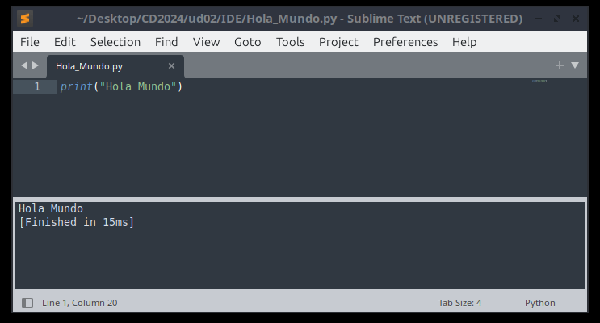

Razones para seleccionar Sublime Text
    Buscando diferentes opcións, apareceume recomendado en diferentes webs como unha das primeiras opción.
    Como características falan de:
- A gran velocidade 
- A lixeireza
- Que é multiplataforma
- Interfaz minimalista
- Con bastantes complementos

Instalación de Sublime Text en Linux:

1. Primeiro instalamos as dependencias
    
    `sudo apt install apt-transport-https ca-certificates curl software-properties-common gnupg`

1. Despois sescargamos a clave GPG e gardala directamente no directorio adecuado:
    
    `curl -fsSL https://download.sublimetext.com/sublimehq-pub.gpg | sudo tee /etc/apt/trusted.gpg.d/sublimehq-pub.gpg > /dev/null`

1. Agregamos o repositorio de Sublime
    
    `sudo add-apt-repository "deb https://download.sublimetext.com/ apt/stable/"`

1. Por último actualizamos os repositorios e instalamos Sublime.

    `sudo apt update`
    `sudo apt install sublime-text`

Interpretación Hola_Mundo.py

1. Primeiro, creamos un novo arquivo (file, new file).

1. Segundo, engadimos o código.

1. Terceiro, gardamos o arquivo (save as...).

1. Por último, executamos o código (tools, build).

